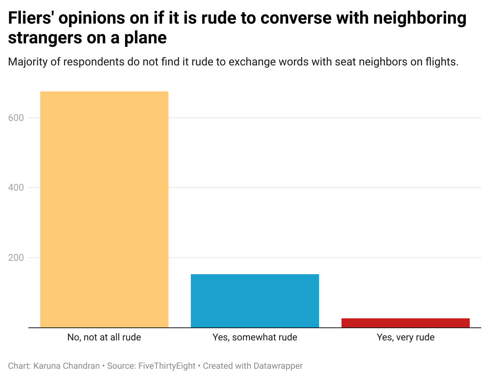

# Flying Etiquette Survey and Analysis

## Why this data set?

I picked this particular data set because I find societal conventions really fascinating,
specifically when people are forced to exist in close proximity to one another like on a plane.
I thought it would be really interesting to understand if people felt that plane conversation
with nearby strangers was rude or if they felt that it was something that they did not mind.

I thought it was interesting that the _"yes it is rude"_ was split into _"somewhat"_ and
_"very rude"_ which I thought made for an interesting distinction of whether it was more
of a small inconvenience or something that greatly bothered the respondent, versus the
_"no it is not rude"_ was just left as one category.

Based on an initial surface look at the dataset, it seemed like a great majority did not find it
rude at all, greatly outnumbering both the _somewhat rude_ and _very rude_. The _somewhat rude_
group also seemed significantly larger than the _very rude_ group. I found these large disparities
surprising, which motivated me further to do a proper analysis.

## Methodology

I used a Pivot Table to summarize the results of the survey in response to the question,
**"Generally speaking, is it rude to say more than a few words to the stranger sitting
next to you on a plane?"**

I then used a column graph based on the pivot table values to emphasize the relative
heights of each of the categories.

## Results

The graph helped to show just how many more people found it not rude at all to converse
with people compared to both the _somewhat_ and _very rude_.

A picture of the graph is shown below. You can also view the [raw data](flying-etiquette-raw-data.csv)
and the [pivot table](flying-etiquette-pivot-table) as well.

